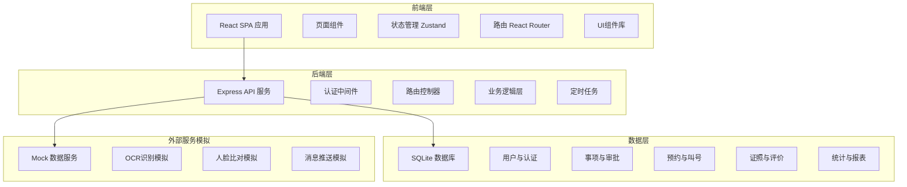
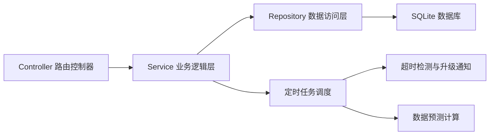
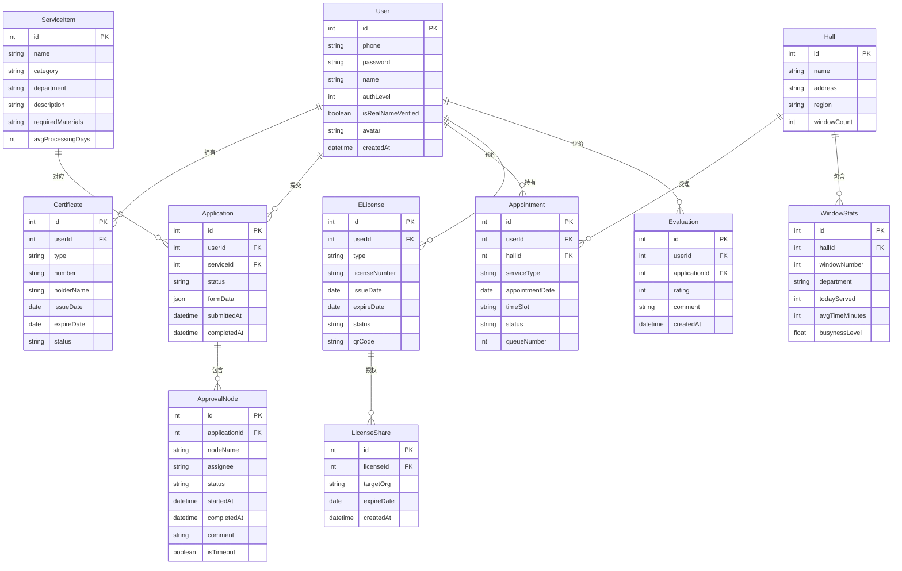

## 1. 架构设计



## 2. 技术说明

- **前端**：React@18 + TypeScript + Tailwind CSS@3 + Vite
- **初始化工具**：vite-init（react-express-ts 模板）
- **后端**：Express@4 + TypeScript（ESM格式）
- **数据库**：SQLite（better-sqlite3），使用Mock数据填充
- **状态管理**：Zustand
- **路由**：React Router DOM v6
- **图表**：Recharts
- **图标**：lucide-react
- **日期处理**：date-fns

## 3. 路由定义

| 路由 | 用途 |
|------|------|
| `/` | 首页，智能推荐、快捷入口、办件进度 |
| `/login` | 登录页 |
| `/register` | 注册页 |
| `/auth/realname` | 实名认证页 |
| `/certificates` | 证件中心 |
| `/services` | 事项分类浏览 |
| `/services/:id` | 事项详情与申请 |
| `/applications` | 我的办件列表 |
| `/applications/:id` | 办件详情与审批追踪 |
| `/appointment` | 线下预约 |
| `/appointment/queue` | 排队叫号 |
| `/e-licenses` | 电子证照管理 |
| `/e-licenses/apply` | 证照申领 |
| `/e-licenses/share` | 证照授权共享 |
| `/evaluation` | 评价中心 |
| `/admin/dashboard` | 管理看板 |
| `/admin/reports` | 报表与预测 |
| `/admin/windows` | 窗口管理 |

## 4. API定义

### 4.1 认证相关

```typescript
POST /api/auth/register
  Body: { phone: string; password: string; code: string }
  Response: { token: string; user: User }

POST /api/auth/login
  Body: { phone: string; password: string }
  Response: { token: string; user: User }

POST /api/auth/verify-realname
  Body: { idCardFront: string; idCardBack: string; faceImage: string }
  Response: { verified: boolean; level: number; idCardInfo: IdCardInfo }
```

### 4.2 证件管理

```typescript
GET /api/certificates
  Response: Certificate[]

POST /api/certificates
  Body: { type: CertificateType; number: string; images: string[] }
  Response: Certificate

PUT /api/certificates/:id
  Body: { status: string; expireDate: string }
  Response: Certificate
```

### 4.3 事项办理

```typescript
GET /api/services?category=&keyword=
  Response: ServiceItem[]

GET /api/services/:id
  Response: ServiceDetail

GET /api/services/:id/materials?userId=
  Response: MaterialChecklist

POST /api/applications
  Body: { serviceId: string; formData: Record<string, any>; materials: string[] }
  Response: Application
```

### 4.4 审批流程

```typescript
GET /api/applications?status=&page=
  Response: { list: Application[]; total: number }

GET /api/applications/:id
  Response: ApplicationDetail (含审批时间线)

PUT /api/applications/:id/approve
  Body: { node: string; action: 'approve' | 'reject'; comment: string }
  Response: Application

GET /api/applications/:id/timeline
  Response: ApprovalNode[]
```

### 4.5 预约叫号

```typescript
GET /api/halls
  Response: Hall[]

GET /api/halls/:id/slots?date=
  Response: TimeSlot[] (含拥挤度和推荐标记)

POST /api/appointments
  Body: { hallId: string; serviceType: string; date: string; timeSlot: string }
  Response: Appointment

POST /api/appointments/check-in
  Body: { appointmentId: string; qrCode: string }
  Response: { queueNumber: number; estimatedWait: number }

GET /api/queue/status?hallId=
  Response: { currentNumber: number; myNumber: number; waitingCount: number }
```

### 4.6 电子证照

```typescript
GET /api/e-licenses
  Response: ELicense[]

POST /api/e-licenses/apply
  Body: { type: string; materials: string[] }
  Response: ELicense

POST /api/e-licenses/:id/share
  Body: { targetOrg: string; expireDate: string }
  Response: ShareRecord

PUT /api/e-licenses/:id/renew
  Response: ELicense
```

### 4.7 评价系统

```typescript
POST /api/evaluations
  Body: { applicationId: string; rating: number; comment: string }
  Response: Evaluation

GET /api/evaluations/stats?windowId=&departmentId=
  Response: { avgRating: number; totalCount: number; distribution: number[] }
```

### 4.8 管理看板与报表

```typescript
GET /api/admin/dashboard?region=&department=&startDate=&endDate=
  Response: DashboardData

GET /api/admin/prediction
  Response: { nextQuarterPrediction: PredictionData[]; suggestions: Suggestion[] }

GET /api/admin/report?month=&format=
  Response: ReportData | File (PDF/Excel)

GET /api/admin/windows/busyness
  Response: WindowBusyness[]
```

## 5. 服务端架构图



## 6. 数据模型

### 6.1 数据模型定义



### 6.2 数据定义语言

```sql
CREATE TABLE users (
  id INTEGER PRIMARY KEY AUTOINCREMENT,
  phone TEXT NOT NULL UNIQUE,
  password TEXT NOT NULL,
  name TEXT,
  auth_level INTEGER DEFAULT 0,
  is_realname_verified INTEGER DEFAULT 0,
  avatar TEXT,
  role TEXT DEFAULT 'citizen',
  created_at DATETIME DEFAULT CURRENT_TIMESTAMP
);

CREATE TABLE certificates (
  id INTEGER PRIMARY KEY AUTOINCREMENT,
  user_id INTEGER NOT NULL,
  type TEXT NOT NULL,
  number TEXT NOT NULL,
  holder_name TEXT,
  issue_date DATE,
  expire_date DATE,
  status TEXT DEFAULT 'valid',
  FOREIGN KEY (user_id) REFERENCES users(id)
);

CREATE TABLE service_items (
  id INTEGER PRIMARY KEY AUTOINCREMENT,
  name TEXT NOT NULL,
  category TEXT NOT NULL,
  department TEXT NOT NULL,
  description TEXT,
  required_materials TEXT,
  avg_processing_days INTEGER DEFAULT 5
);

CREATE TABLE applications (
  id INTEGER PRIMARY KEY AUTOINCREMENT,
  user_id INTEGER NOT NULL,
  service_id INTEGER NOT NULL,
  status TEXT DEFAULT 'submitted',
  form_data TEXT,
  submitted_at DATETIME DEFAULT CURRENT_TIMESTAMP,
  completed_at DATETIME,
  FOREIGN KEY (user_id) REFERENCES users(id),
  FOREIGN KEY (service_id) REFERENCES service_items(id)
);

CREATE TABLE approval_nodes (
  id INTEGER PRIMARY KEY AUTOINCREMENT,
  application_id INTEGER NOT NULL,
  node_name TEXT NOT NULL,
  node_order INTEGER NOT NULL,
  assignee TEXT,
  status TEXT DEFAULT 'pending',
  started_at DATETIME,
  completed_at DATETIME,
  comment TEXT,
  is_timeout INTEGER DEFAULT 0,
  timeout_hours INTEGER DEFAULT 48,
  FOREIGN KEY (application_id) REFERENCES applications(id)
);

CREATE TABLE halls (
  id INTEGER PRIMARY KEY AUTOINCREMENT,
  name TEXT NOT NULL,
  address TEXT,
  region TEXT,
  window_count INTEGER DEFAULT 10
);

CREATE TABLE appointments (
  id INTEGER PRIMARY KEY AUTOINCREMENT,
  user_id INTEGER NOT NULL,
  hall_id INTEGER NOT NULL,
  service_type TEXT,
  appointment_date DATE NOT NULL,
  time_slot TEXT NOT NULL,
  status TEXT DEFAULT 'booked',
  queue_number INTEGER,
  checked_in_at DATETIME,
  FOREIGN KEY (user_id) REFERENCES users(id),
  FOREIGN KEY (hall_id) REFERENCES halls(id)
);

CREATE TABLE e_licenses (
  id INTEGER PRIMARY KEY AUTOINCREMENT,
  user_id INTEGER NOT NULL,
  type TEXT NOT NULL,
  license_number TEXT NOT NULL,
  issue_date DATE,
  expire_date DATE,
  status TEXT DEFAULT 'active',
  qr_code TEXT,
  FOREIGN KEY (user_id) REFERENCES users(id)
);

CREATE TABLE license_shares (
  id INTEGER PRIMARY KEY AUTOINCREMENT,
  license_id INTEGER NOT NULL,
  target_org TEXT NOT NULL,
  expire_date DATE,
  created_at DATETIME DEFAULT CURRENT_TIMESTAMP,
  FOREIGN KEY (license_id) REFERENCES e_licenses(id)
);

CREATE TABLE evaluations (
  id INTEGER PRIMARY KEY AUTOINCREMENT,
  user_id INTEGER NOT NULL,
  application_id INTEGER NOT NULL,
  rating INTEGER NOT NULL CHECK(rating >= 1 AND rating <= 5),
  comment TEXT,
  created_at DATETIME DEFAULT CURRENT_TIMESTAMP,
  FOREIGN KEY (user_id) REFERENCES users(id),
  FOREIGN KEY (application_id) REFERENCES applications(id)
);

CREATE TABLE window_stats (
  id INTEGER PRIMARY KEY AUTOINCREMENT,
  hall_id INTEGER NOT NULL,
  window_number INTEGER NOT NULL,
  department TEXT,
  today_served INTEGER DEFAULT 0,
  avg_time_minutes INTEGER DEFAULT 0,
  busyness_level REAL DEFAULT 0,
  FOREIGN KEY (hall_id) REFERENCES halls(id)
);

CREATE INDEX idx_applications_user ON applications(user_id);
CREATE INDEX idx_applications_status ON applications(status);
CREATE INDEX idx_approval_nodes_app ON approval_nodes(application_id);
CREATE INDEX idx_certificates_user ON certificates(user_id);
CREATE INDEX idx_appointments_user ON appointments(user_id);
CREATE INDEX idx_appointments_hall_date ON appointments(hall_id, appointment_date);
CREATE INDEX idx_evaluations_app ON evaluations(application_id);
CREATE INDEX idx_window_stats_hall ON window_stats(hall_id);
```
